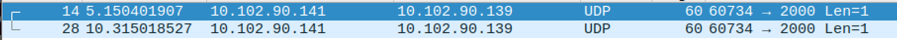
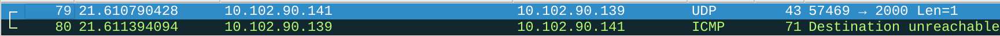
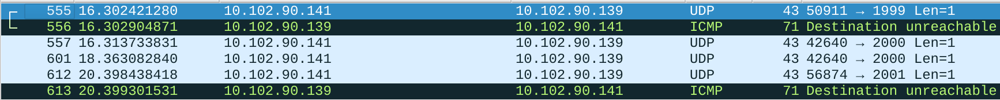
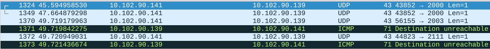
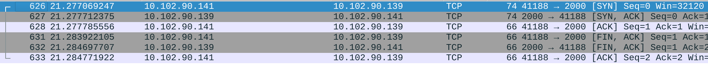

# Project 2 - OMEGA: L4 Scanner
### Autor: Jakub Fukala (xfukal01)

## Obsah

1. [**Úvod**](#úvod)
2. [**Teorie skenování portů**](#teorie-skenování-portů)
3. [**Spuštění**](#spuštění)
4. [**Implementovaná funkcionalita**](#implementovaná-funkcionalita)
5. [**Testování**](#testování)
6. [**Dodatečná funkcionalita**](#dodatečná-funkcionalita)
7. [**Návratové kódy**](#návratové-kódy)
8. [**Zdroje**](#zdroje)

## Úvod
Cílem projektu bylo vytvořit síťový skener, který bude schopen skenovat cílový počítač pomocí různých protokolů. 
V mém případě jsem se zaměřil na skenování pomocí protokolu TCP a UDP. Program je schopen skenovat cílový počítač z 
jednoho rozhraní a zobrazit informace o dostupných portech. Program je napsán v jazyce C#.

## Teorie skenování portů

### UDP skenování
UDP je protokol, který je založen na principu posílání datových paketů bez navázání spojení.
Pro skenování pomocí UDP je potřeba vytvořit soket, který bude schopen posílat data pomocí UDP protokolu.
Při skenování je potřeba poslat datový paket na cílový port a čekat na odpověď. Pokud je odpovědí packet 
ICMP s typem 3 a kódem 3, tak je port uzavřený. Pokud žádná odpověď nepřijde, tak je port otevřený.

### TCP skenování
TCP je spojovaný protokol, který používá třícestné potřesení rukou pro navázání spojení.
Pro skenování pomocí TCP je nutné vytvořit spojení s cílovým portem a zpracovat odpověď. Existují různé typy TCP skenování:
- **SYN skenování**: Posílá SYN packet na cílový port. Pokud je odpověď SYN-ACK, je port otevřený. Pokud je odpověď RST, je port uzavřený.
- **FIN skenování**: Posílá FIN packet na cílový port. Pokud je odpověď RST, je port otevřený. Pokud je odpověď FIN-ACK, je port uzavřený.
- **NULL skenování**: Neposílá žádný speciální packet. Pokud je odpověď RST, je port otevřený. Pokud je odpověď SYN-ACK nebo nic, je port uzavřený.

## Spuštění

Program je možné spustit pomocí příkazové řádky s následujícími argumenty:
- `-i <rozhraní>`/ `--interface <rozhraní> ` - specifikuje rozhraní, ze kterého bude program skenovat
- `-u <porty>`/ `--pu <porty>` - specifikuje porty, které budou skenovány pomocí UDP protokolu
- `-t <porty>`/ `--pt <porty>` - specifikuje porty, které budou skenovány pomocí TCP protokolu
- `-w <timeout>`/ `--wait <timeout>` - specifikuje timeout pro čekání na odpověď (v ms) (defaultně 5000ms)
- `-r` /  - specifikuje, počet pokusů o opětovné odeslání packetu při neobdržení odpovědi během UDP skenování (defaultně 1)
- `-d` / `--debug` - specifikuje, zda se mají zobrazovat ladící informace
- Dále musí být zadán cíl skenování čili **IP adresa** cíle nebo **doménové jméno**

### Formát portů
- Porty mohou být zadány jako jednotlivé čísla nebo rozsahy oddělené pomlčkou (např. 22-80)
- Porty mohou být odděleny čárkou (např. 22,80,443)


## Implementovaná funkcionalita

- Program je schopen skenovat cílový počítač pomocí protokolu TCP a UDP pomocí zadaného rozhraní a 
zobrazovat informace o dostupných portech.


## Testování
Fedora 39 -> Ubuntu 64-bit 

- Funkčnost programu byla otestována pomocí nástroje Wireshark, který zachycuje síťový provoz.
- V rámci testovaní je program spoušten s parametrem `-d`, který zobrazuje ladící informace.


### UDP skenování
#### Skenování otevřeného portu

- Spouštěno : `ipk-l4-scan -i wlo1 -u 2000 10.102.90.139 -w 2000 -d`
- Výstup:
```
Interface: wlo1
Target: 10.102.90.139
Timeout: 2000
TCP ports:
UDP ports: 2000
Interface IP: 10.102.90.141
Interface IPv6fe80::dd3:b0a0:cfc9:d1b%3
Retransmission count: 1
Host resolved as: 10.102.90.139
==============================================
2000/udp: Open
```
- Zde je výstřižek z Wiresharku zobrazující tuto komunikaci:


#### Skenování uzavřeného portu
- Spouštěno : `ipk-l4-scan -i wlo1 -u 2000 10.102.90.139 -w 2000 -d`
- Výstup:
```
Interface: wlo1
Target: 10.102.90.139
Timeout: 2000
TCP ports: 
UDP ports: 2000
Interface IP: 10.102.90.141
Interface IPv6: fe80::dd3:b0a0:cfc9:d1b%3
Retransmission count: 1
Host resolved as: 10.102.90.139 
==============================================
2000/udp: Closed
```
- Zde je výstřižek z Wiresharku zobrazující tuto komunikaci:


#### Skenovaní rozsahu portů
- Spuštěno: `ipk-l4-scan -i wlo1 -u 1999-2001 10.102.90.139 -w 2000 -d`
- Výstup:
```
Interface: wlo1
Target: 10.102.90.139
Timeout: 2000
TCP ports: 
UDP ports: 1999, 2000, 2001
Interface IP: 10.102.90.141
Interface IPv6: fe80::dd3:b0a0:cfc9:d1b%3
Retransmission count: 1
Host resolved as: 10.102.90.139 
==============================================
1999/udp: Closed
2000/udp: Open
2001/udp: Closed
```
- Výstřižek z Wiresharku:


#### Skenování seznamu portů
- Spuštěno: `ipk-l4-scan -i wlo1 -u 2000,2003,2111 10.102.90.139 -w 2000 -d`
- Výstup:
```
Interface: wlo1
Target: 10.102.90.139
Timeout: 2000
TCP ports: 
UDP ports: 2000, 2003, 2111
Interface IP: 10.102.90.141
Interface IPv6: fe80::dd3:b0a0:cfc9:d1b%3
Retransmission count: 1
Host resolved as: 10.102.90.139 
==============================================
2000/udp: Open
2003/udp: Closed
2111/udp: Closed
```

- Výstřižek z Wiresharku:
- 

### TCP skenování
#### Skenování otevřeného portu
- Ubuntu spouštěno: `nc -4 -l -v 10.102.90.139 2000`   
- Fedora spouštěno: `ipk-l4-scan -i wlo1 -t 2000 10.102.90.139 -w 2000 -d`
- Výstup:
```
Interface: wlo1
Target: 10.102.90.139
Timeout: 2000
TCP ports: 2000
UDP ports: 
Interface IP: 10.102.90.141
Interface IPv6: fe80::dd3:b0a0:cfc9:d1b%3
Retransmission count: 1
Host resolved as: 10.102.90.139 
==============================================
2000/tcp: Open
```
- Výstřižek z Wiresharku:
- 


## Dodatečná funkcionalita


## Návratové kódy
- `0` - vše proběhlo v pořádku
- `1` - Zadané rozhraní není aktivní nebo neexistuje např. l0 namísto lo
- `2` - Špatný format argumentu rozhraní (např. -i <nic>)
- `3` - Špatný formát argumentu portu (např. -u 22, , -u 22- , -u 22,-2, -u y-x)
- `4` - Nebyly poskytnuty nezbytné argumenty
- `5` - Cíl nedostupný z daného rozhraní
- `6` - Lokální rozhraní nemá přirazenou IPv6 adresu

## Zdroje
- [Získání informací o aktivních rozhraních](https://learn.microsoft.com/en-us/dotnet/api/system.net.networkinformation?view=net-8.0)
- [gitignore](https://github.com/github/gitignore/blob/main/VisualStudio.gitignore)
### Získaní informací o cíli
- [Dns Class](https://learn.microsoft.com/en-us/dotnet/api/system.net.dns?view=net-8.0)
- [IPaddress Class](https://learn.microsoft.com/en-us/dotnet/api/system.net.ipaddress?view=net-8.0)
### Sokety
- [Raw Sokets](https://www.opensourceforu.com/2015/03/a-guide-to-using-raw-sockets/)
- [TCP](https://learn.microsoft.com/en-us/dotnet/fundamentals/networking/sockets/socket-services)